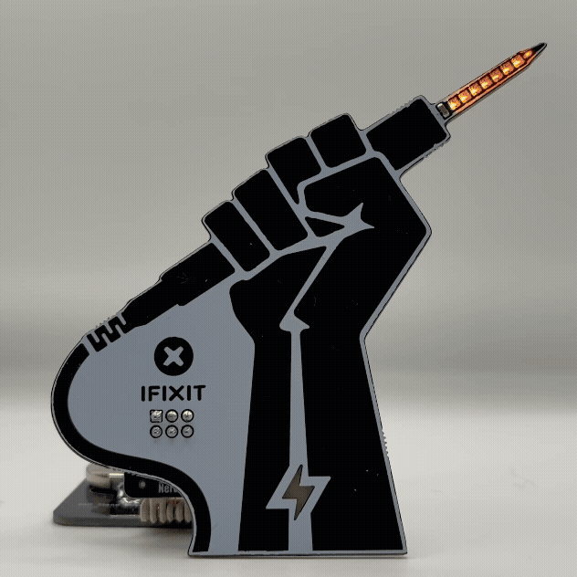

# 2026 iFixit SAO

This repository contains the firmware and supporting files for 2026 iFixit Shitty Add On (SAO) featuring multiple LED animation modes, an interactive soldering challenge, and user-programmable firmware.

![2026 iFixit SAO] (images/ifixit-2026-sao.jpg)

## Project Structure

The repository is organized into three main directories:

```text
.
├── art/
├── code/
└── pcb/
```

### `art`

The [`art`](art/) directory contains the visual artwork used to create the badge. Each layer of the badge artwork is provided in SVG format, making it possible to inspect, modify, or reuse the individual design elements.

### `code`

The [`code`](code/) directory contains the badge firmware. It is configured as a PlatformIO project and uses the Arduino framework for the ATtiny1604-SS microcontroller.

See the [Programming the Badge](#programming-the-badge) section for more information about building and uploading the firmware.

### `pcb`

The [`pcb`](pcb/) directory contains the KiCad project files for the badge, including the electrical schematic and PCB layout.


## How the Badge Operates

The badge has three default animation modes:

1. **Off**
2. **Candle**
3. **Propane**

Press the button to cycle through the available modes. Each press advances the badge to the next mode.

The **lightning-bolt animation is always active**, regardless of which animation mode is selected.



## Soldering Challenge

An additional animation mode can be unlocked by completing the badge's surface-mount soldering challenge.

Solder the following **0 Ω resistors** onto the indicated footprints:

| Footprint | Resistor size | Resistor value |
|---|---:|---:|
| `R5` | 1206 | 0 Ω |
| `R7` | 0805 | 0 Ω |
| `R9` | 0603 | 0 Ω |
| `R11` | 0402 | 0 Ω |

Once all four resistors are installed correctly, the badge will unlock an additional animation mode.

For convenience, resistors of the correct sizes and values are already installed in the following locations:

| Challenge footprint | Donor footprint |
|---|---|
| `R5` | `R6` |
| `R7` | `R8` |
| `R9` | `R10` |
| `R11` | `R12` |

You can desolder the resistors from `R6`, `R8`, `R10`, and `R12`, then resolder them onto their corresponding challenge footprints. You may also use your own 0 Ω resistors instead.

> [!TIP]
> Start with the largest component, the 1206 resistor, and work toward the smallest. Use plenty of flux, fine-point tweezers, an adequate magnification—especially for the 0402 resistor, and of course, an iFixit FixHub!

<!-- PHOTO: Add a close-up photo identifying R5 through R12. -->
<!-- Example:  -->

<!-- PHOTO: Add a photo of the completed soldering challenge. -->
<!-- Example:  -->

## Programming the Badge

The badge is controlled by an **ATtiny1604-SS** microcontroller.

It can be programmed using the **UPDI** protocol through the exposed programming pads on the PCB. The programming pads use a **2.54 mm pitch**, making them compatible with common pin headers, pogo-pin adapters, or jumper-wire connections. The pads are labled D (for data), + (for postiive voltage), and - (for ground). 

A programmer such as the **Adafruit UPDI Friend** can be used to upload firmware to the badge.

<!-- PHOTO: Add a close-up photo labeling the UPDI programming pads. -->
<!-- Example:  -->

### Firmware

The badge firmware is located in the [`code`](code/) directory.

The firmware is configured as a **PlatformIO** project and uses the **Arduino framework**. Open the `code` directory as a PlatformIO project to build or modify the firmware.

A typical workflow is:

1. Install [Visual Studio Code](https://code.visualstudio.com/).
2. Install the [PlatformIO IDE extension](https://platformio.org/install/ide?install=vscode).
3. Open the [`code`](code/) directory in PlatformIO.
4. Connect a UPDI programmer to the badge's programming pads.
5. Build and upload the firmware.

> [!CAUTION]
> The badge is designed to operate on 3.3V. Confirm the programmer voltage and all programming-pad connections before powering or programming the badge. Incorrect wiring may damage the microcontroller or programmer.

<!-- PHOTO: Add a photo showing the badge connected to a UPDI programmer. -->
<!-- Example:  -->
